# 操作系统概述

## 概念


+ 操作系统是指 `控制` 和 `管理` 整个计算机系统的 `硬件` 和 `软件` 资源,并合理地组织调度计算机的工作和资源的分配;以提供给用户和其他软件方便的接口和环境;是计算机系统中最基本的系统软件

## 功能和目标

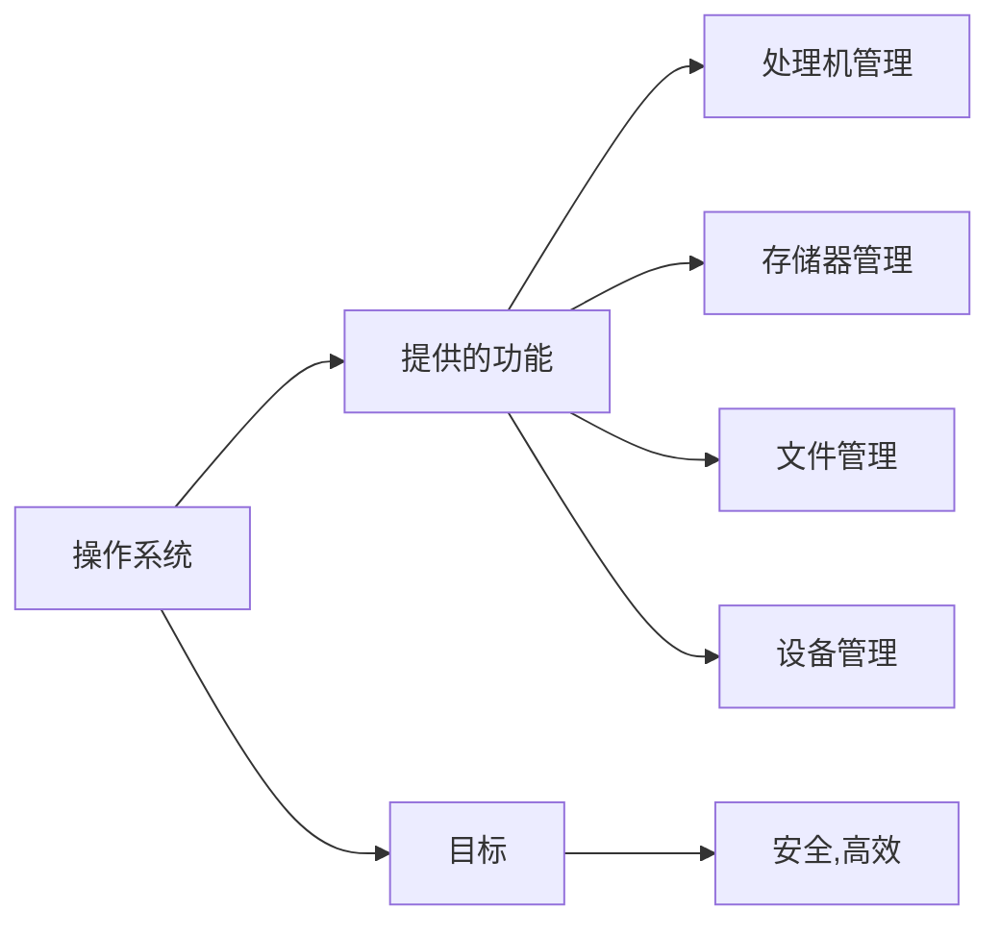
```mermaid
graph LR;
    A[操作系统]-->B[提供的功能]; 
    A-->C[目标];
    C-->E[安全,高效];
    B-->D[处理机管理];
    B-->F[存储器管理];
    B-->G[文件管理];
    B-->H[设备管理];
```

## 提供接口

+ 脱机命令接口

`.bat` 文件中批量的命令

+ 联机命令接口

`cmd` 中执行的交互式命令,如 `ping` 命令

+ 程序接口

普通用户不能直接使用程序接口, 只能通过程序代码间接使用, 如 `printf` 调用了系统内关于显示的程序接口


## 特征

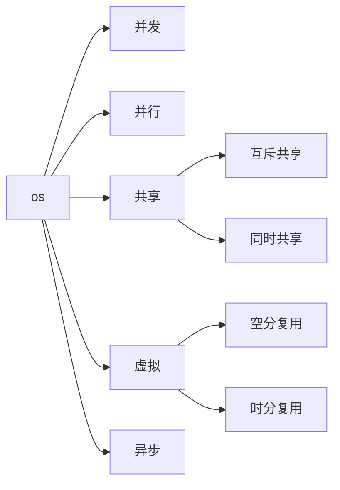
```mermaid
graph LR;
a[os]-->b[并发];
a-->c[并行];
a-->d[共享];
d-->f[互斥共享];
d-->h[同时共享];
a-->i[虚拟];
i-->j[空分复用];
i-->k[时分复用];
a-->l[异步];
```


+ <font color='orange'>并发</font>

指两个或多个事件在同一个时间间隔内发生,这些事件在<font color='red'>宏观上是同时发生</font>,但<font color='red'>微观上是交替发生</font>

+ <font color='orange'>并行</font>

指两个或多个事件在同一时刻同时发生

+ <font color='orange'>共享</font>

  指资源共享,系统中的资源可供内存中多个并发执行的进程共同使用

  1. <font color='orange'>互斥共享</font>

     系统中的某些资源,可供多个进程使用,但<font color='red'>一个时间段内只允许一个进程访问该资源</font>

  2. <font color='orange'>同时共享</font>

     系统中的某些资源,可供多个进程使用,但<font color='red'>一个时间段内允许多个进程分时访问该资源</font>

+ <font color='orange'>虚拟</font>

  指把一个物理上的实体变为若干个逻辑上的对应物

  1. <font color='orange'>空分复用</font>: 虚拟存储器技术
  2. <font color='orange'>时分复用</font>: 虚拟处理器技术

+ <font color='orange'>异步</font>

  系统并发执行不同程序过程中, 由于资源竞争, 进程的执行不是一贯到底的, 总会有阻塞态发生, 系统走走停停, 不可预知的向前推进 ==只有系统具有并发性,才可能有异步==


> **注意**
>
> `单核CPU` 同一时刻只能执行 `一个程序`, 各个程序只能 `并发` 执行
>
> `多核CPU` 同一时刻可以同时执行 `多个程序`, 多个程序可以 `并行` 执行


指多道程序环境下,运行多个程序并发执行,但由于不同进程争夺系统资源,并发运行中的进程有可能因为资源有限而被阻塞运行,导致进程以不可预知的速度向前推进,进程互相不同步

---

> ==并发和共享互为存在条件==
>
> **没有并发就不需要共享和虚拟,并发才可能导致异步**

---


# 操作系统发展和分类

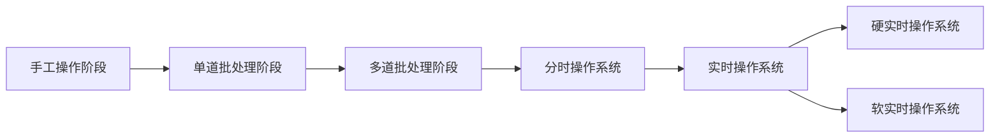
```mermaid
graph LR;
1[手工操作阶段]-->2[单道批处理阶段]-->3[多道批处理阶段]-->4[分时操作系统]-->6[实时操作系统];
6-->7[硬实时操作系统];
6-->8[软实时操作系统]
```

+ <font color='orange'>单道批处理</font>


+ <font color='orange'>多道批处理</font>


# 操作系统运行机制

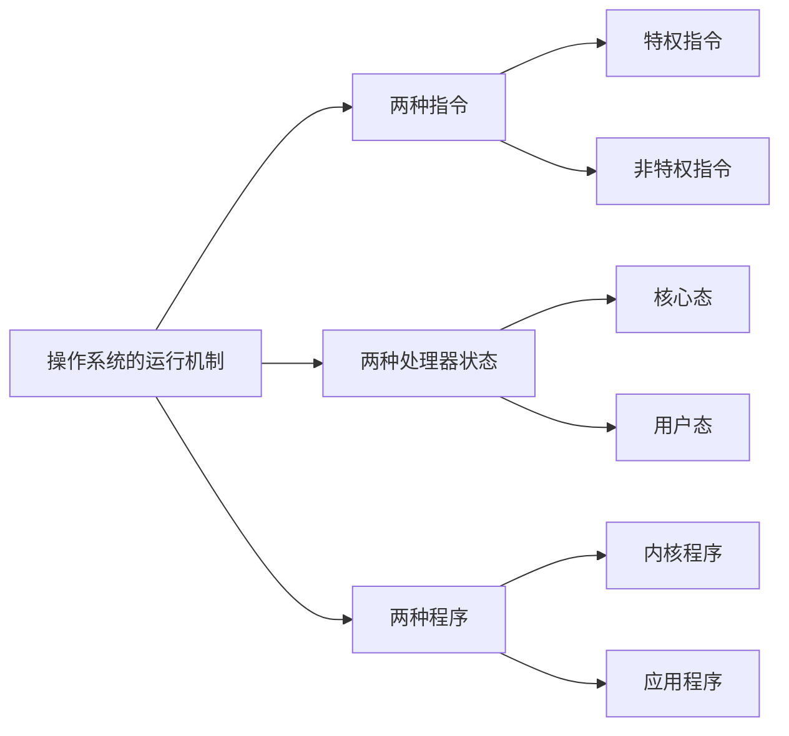
```mermaid
graph LR;
1[操作系统的运行机制]-->2[两种指令];
2-->3[特权指令];
2-->4[非特权指令];
1-->5[两种处理器状态];
5-->6[核心态];
5-->7[用户态];
1-->8[两种程序];
8-->9[内核程序];
8-->10[应用程序];
```


普通程序员编写的是”<font color='orange'>应用程序</font>“，微软、苹果程序员负责实现操作系统，其编写内核程序组成了“<font color='orange'>操作系统内核</font>”，简称“<font color='orange'>内核（kernel）</font>”，内核是操作系统最重要最核心的部分，<font color='orange'>也是最接近硬件的部分</font>


## 两种处理器状态

+ <font color='orange'>内核态</font>

  说明此时运行的是内核程序，此时可以执行特权指令

+ <font color='orange'>用户态</font>

  说明此时运行的是应用程序，此时只能执行非特权指令
  
  > ==注意==💢
  >
  > 用户态下仍可以通过某些系统接口, 触发 `软中断`, 临时切换到内核态, 由操作系统验证系统调用的合法性,并执行特权指令, 然后切回用户态

> CPU 中有个寄存器 `PSW`，其中有个二进制位，1 表示“内核态”， 0 表示“用户态”
>
> ==<font color='red'>别名</font>：内核态=核心态=管态； 用户态=目态==
>
> <font color='red'>“中断”是让操作系统内核夺回cpu使用权的唯一途径</font>


## 中断和异常

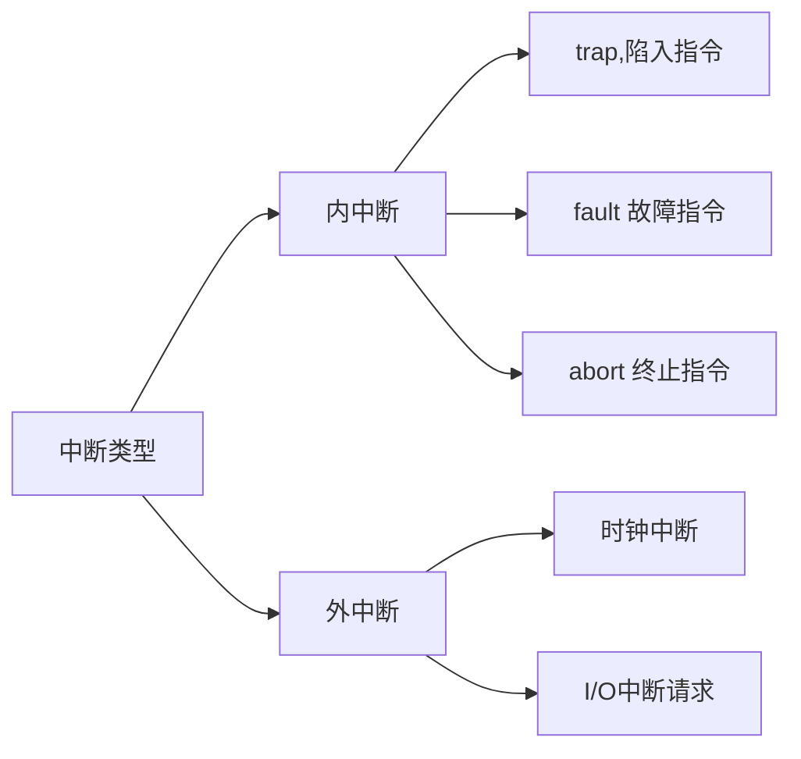
```mermaid
graph LR;
1[中断类型]-->2[内中断];
2-->4[trap,陷入指令];
2-->5[fault 故障指令];
2-->6[abort 终止指令];
1-->3[外中断];
3-->7[时钟中断];
3-->8[I/O中断请求];

```

+ <font color='orange'>内中断(也称"异常")</font>

  与当前执行的指令有关,中断信号来自cpu内部

+ <font color='orange'>外中断(也称"中断")</font>

  与当前执行的指令无关,中断信号来自cpu外部

## 中断机制的基本原理

不同中断信号,需要不同的中断处理程序来处理,当cpu检测到中断信号后,会根据中断信号类型查询"中断向量表",以此找到相应的中断处理程序在内存中的存放位置


# 系统内核


+ 注意:
  + 操作系统的<font color='red'>内核</font>需要运行在<font color='red'>内核态</font>
  + 操作系统的<font color='red'>非内核</font>需要运行在<font color='red'>用户态</font>

# 操作系统体系结构

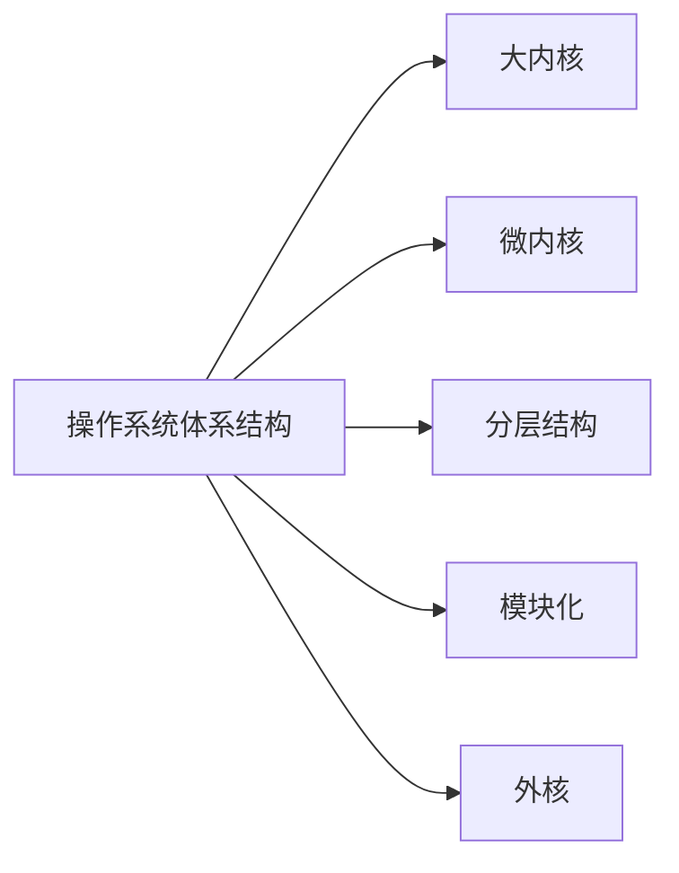
```mermaid
graph LR;
1[操作系统体系结构]-->2[大内核];
1-->3[微内核];
1-->4[分层结构];
1-->5[模块化];
1-->6[外核]
```


# 系统引导


# 虚拟机

<font color='orange'>虚拟机</font>: 使用虚拟化技术,将一台物理机器虚拟化为多台机器(Virtual Machine, VM),每个虚拟机都可以独立运行一个操作系统

## 第一类虚拟机管理程序


+ 本质上可以理解为更深一层的套娃，VMM 运行在真正的内核态，将硬件资源划分分配给各个系统，把 CPU 时钟切片分配。
+ 系统事实上运行在用户态，当其调用特权指令时会被 VMM 截获，并被 VMM 等效实现响应且返回给系统，在结果上等价于系统成功调用特权指令

## 第二类虚拟机管理程序


## 对比


# 进程

## 概念

<font color='orange'>程序</font>：是<font color='red'>静态的</font>，存放在磁盘里的可执行文件，是一系列的指令集合

<font color='orange'>进程</font>：是<font color='red'>动态的</font>，是程序的一次执行过程

<font color='orange'>PID</font>：进程被创建时，被赋予的唯一标识编码

<font color='orange'>PCB</font>：<font color='red'>进程控制块</font>，保存进程信息的数据结构，记录了cpu使用时间、磁盘使用情况、网络流量等等信息

==PCB是进程存在的唯一标志==

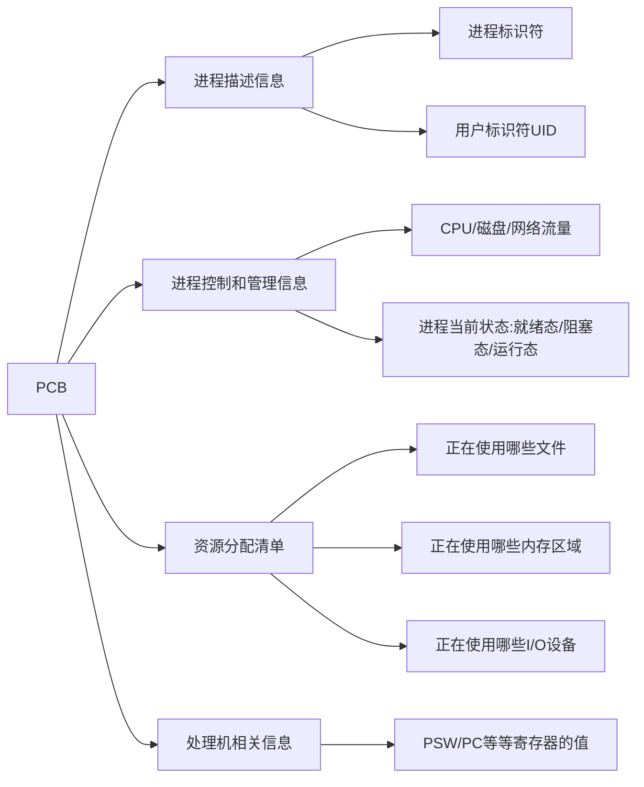
```mermaid
graph LR;
1[PCB]-->2[进程描述信息]-->3[进程标识符];
2-->4[用户标识符UID];
1-->5[进程控制和管理信息]-->CPU/磁盘/网络流量
5-->进程当前状态:就绪态/阻塞态/运行态
1-->7[资源分配清单]-->正在使用哪些文件
7-->正在使用哪些内存区域;
7-->正在使用哪些I/O设备
1-->8[处理机相关信息]-->PSW/PC等等寄存器的值

```


## 组成

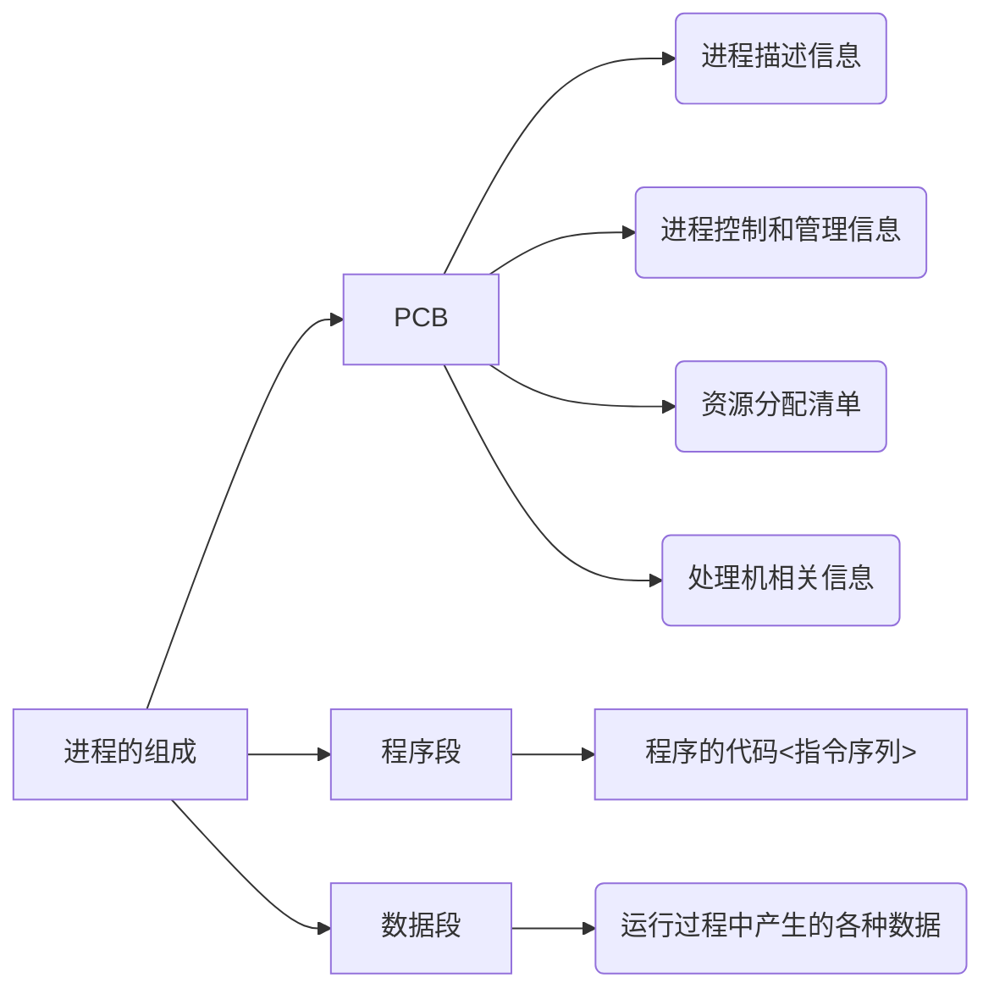
```mermaid
graph LR;
1[进程的组成]-->2[PCB]-->a(进程描述信息)
2-->b(进程控制和管理信息)
2-->c(资源分配清单)
2-->d(处理机相关信息)
1-->3[程序段]-->e[程序的代码<指令序列>]
1-->数据段-->f(运行过程中产生的各种数据)
```


## 特征

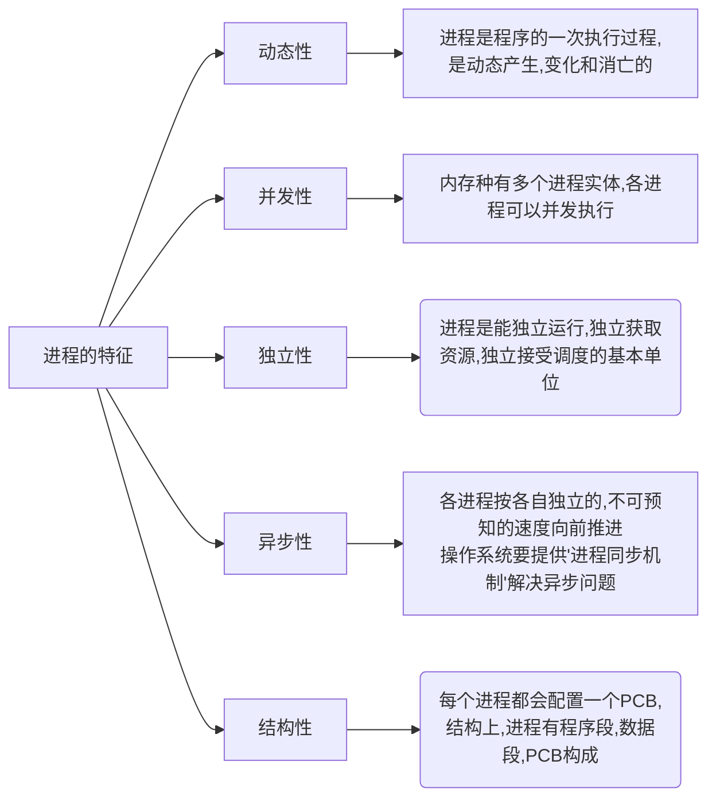
```mermaid
graph LR;
1[进程的特征]-->2[动态性]-->a[进程是程序的一次执行过程,是动态产生,变化和消亡的]
1-->并发性-->b[内存种有多个进程实体,各进程可以并发执行]
1-->独立性-->c(进程是能独立运行,独立获取资源,独立接受调度的基本单位)
1-->异步性-->3[各进程按各自独立的,不可预知的速度向前推进<br>操作系统要提供'进程同步机制'解决异步问题]
1-->结构性-->d(每个进程都会配置一个PCB,结构上,进程有程序段,数据段,PCB构成)
```

## 状态

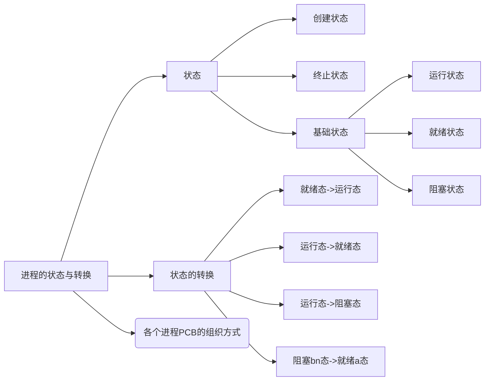
```mermaid
graph LR;
1[进程的状态与转换]-->2[状态];
2-->8[创建状态];
2-->9[终止状态];
2-->i[基础状态];
1-->3[状态的转换];
1-->4(各个进程PCB的组织方式);

i-->5[运行状态];
i-->6[就绪状态];
i-->7[阻塞状态];
3-->a[就绪态->运行态];
3-->b[运行态->就绪态];
3-->c[运行态->阻塞态];
3-->d[阻塞bn态->就绪a态];
```

### 状态

+ 进程正在被创建时,它的状态是"<font color='red'>创建态</font>"，在这个阶段系统会进行资源分配、初始化 PCB
+ 进程完成创建后，就进入“<font color='red'>就绪态</font>”，处于就绪态的进程已经具备运行条件，但是暂无空闲CPU，就无法运行
+ “<font color='red'>运行态</font>”指一个进程此时在 CPU 上运行，CPU会执行该进程对应的程序（执行指令序列）
+ 当进程运行过程中请求CPU分配系统资源，此时可能发生系统繁忙，无可用资源分配的情况（例如打印机被其他进程占用），那么进程就无法继续运行，此时进程会主动调用系统接口, 让操作系统停止运行该进程，进程进入“<font color='red'>阻塞态</font>”
+ 一个进程可以执行 `exit` 系统调用,请求操作系统终止该进程,此时该进程进入"<font color='red'>终止态</font>"

> ==进程PCB中,会有一个变量state表示进程的当前状态==


### 状态转换

> 1. 进程用"系统调用"的方式申请某种系统资源,或者请求等待某个事件发生时会由**运行态**转为**阻塞态**
> 2. **运行态**到**阻塞态**时一种进程自身做出的<font color='red'>主动行为</font>
> 3. **阻塞态**到**运行态**是不能由进程自身控制的,是<font color='red'>被动行为</font>
> 4. **运行态**到**就绪态**有时可以互相直接转换，当cpu时间片耗尽时，进程跳转会就绪态等待下一次调度

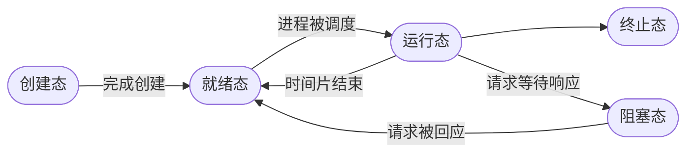
```mermaid
graph LR;
a([创建态])--完成创建-->b([就绪态])
b--进程被调度-->c([运行态])
c--时间片结束-->b
c-->e([终止态])
c--请求等待响应-->d([阻塞态])
d--请求被回应-->b;
```

### 进程组织

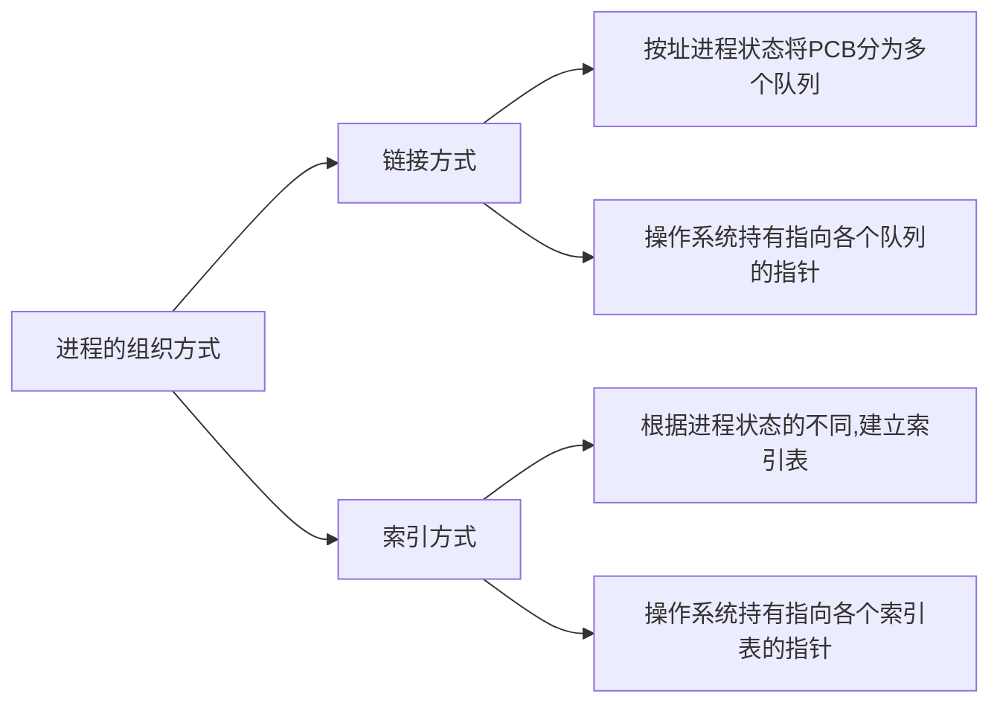
```mermaid
graph LR;
1[进程的组织方式]-->2[链接方式];
1-->3[索引方式];
2-->a[按址进程状态将PCB分为多个队列]
2-->b[操作系统持有指向各个队列的指针]
3-->c[根据进程状态的不同,建立索引表]
3-->d[操作系统持有指向各个索引表的指针]
```


+ 链式组织


+ 索引组织


## 控制(实现状态转换)

+ 进程的状态转换,需要<font color='red'>一步到位</font>,不能出现阻塞队列的某个进程PCB的**state**属性已经时**就绪态**了,但进程仍处在阻塞队列中

+ <font color='red'>关中断指令</font>和<font color='red'>开中断指令</font>都是<font color='red'>特权指令</font>，可实现其中的指令不被中断，一步到位


### 创建到就绪

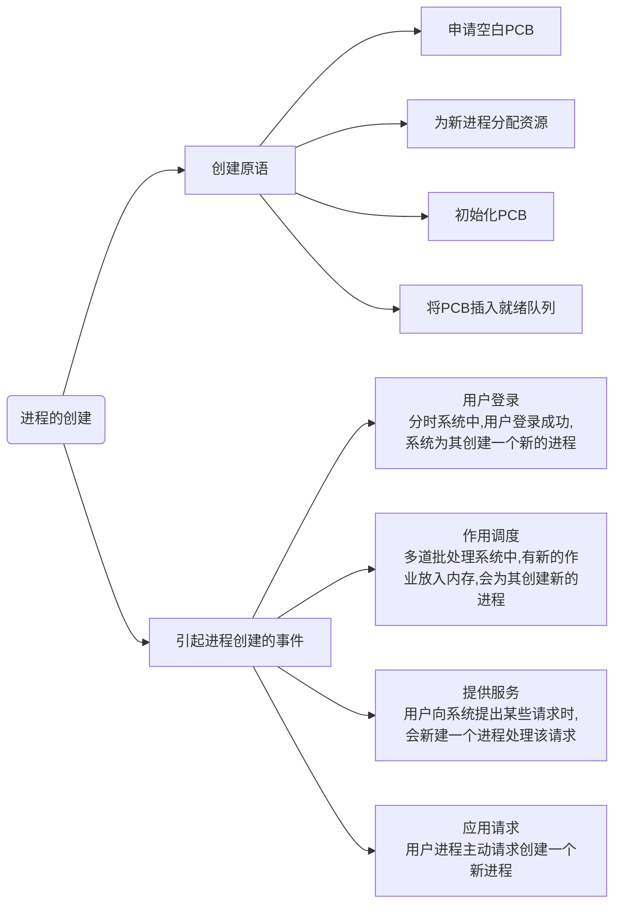
```mermaid
graph LR;
1(进程的创建)-->2[创建原语];
1-->3[引起进程创建的事件];
2-->申请空白PCB
2-->为新进程分配资源
2-->初始化PCB
2-->将PCB插入就绪队列
3-->a[用户登录<br>分时系统中,用户登录成功,系统为其创建一个新的进程]
3-->b[作用调度<br>多道批处理系统中,有新的作业放入内存,会为其创建新的进程]
3-->c[提供服务<br>用户向系统提出某些请求时,会新建一个进程处理该请求]
3-->d[应用请求<br>用户进程主动请求创建一个新进程]
```


### 运行到终止


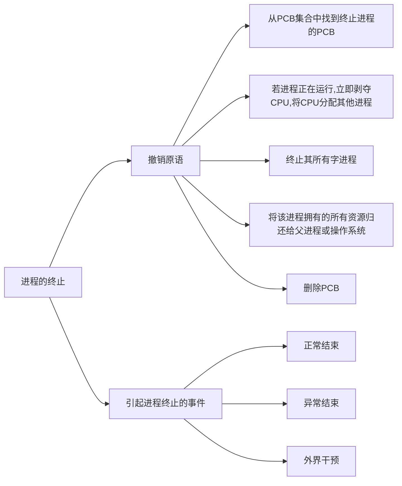
```mermaid
graph LR;
1[进程的终止]-->2[撤销原语];
2-->从PCB集合中找到终止进程的PCB;
2-->若进程正在运行,立即剥夺CPU,将CPU分配其他进程
2-->终止其所有字进程
2-->将该进程拥有的所有资源归还给父进程或操作系统
2-->删除PCB
1-->3[引起进程终止的事件]
3-->正常结束
3-->异常结束
3-->外界干预
```


### 运行到阻塞，阻塞到就绪

+ <font color='orange'>阻塞原语</font>和<font color='orange'>唤醒原语</font>必须成对使用，因为进程由什么事件而阻塞就需要什么事件来唤醒


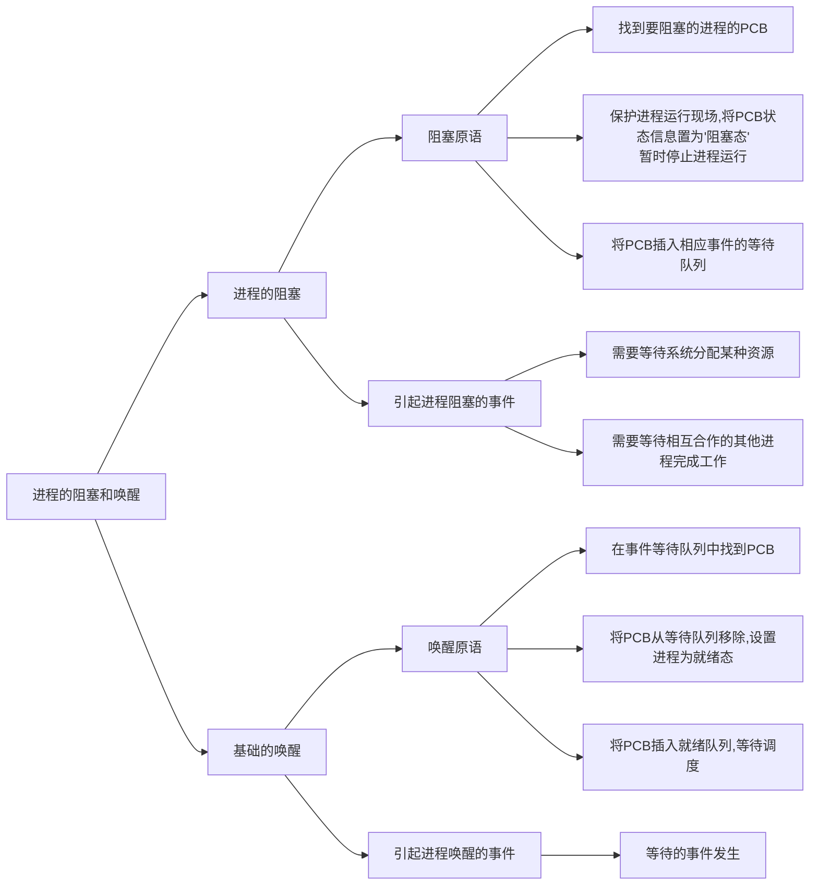
```mermaid
graph LR;
1[进程的阻塞和唤醒]-->2[进程的阻塞]
4-->找到要阻塞的进程的PCB
4-->a[保护进程运行现场,将PCB状态信息置为'阻塞态'<br>暂时停止进程运行]
4-->将PCB插入相应事件的等待队列
1-->3[基础的唤醒]
2-->4[阻塞原语]
2-->5[引起进程阻塞的事件]
5-->需要等待系统分配某种资源
5-->需要等待相互合作的其他进程完成工作
3-->6[唤醒原语]
6-->在事件等待队列中找到PCB
6-->将PCB从等待队列移除,设置进程为就绪态
6-->将PCB插入就绪队列,等待调度
3-->7[引起进程唤醒的事件]
7-->等待的事件发生
```

### 运行到就绪，就绪到运行

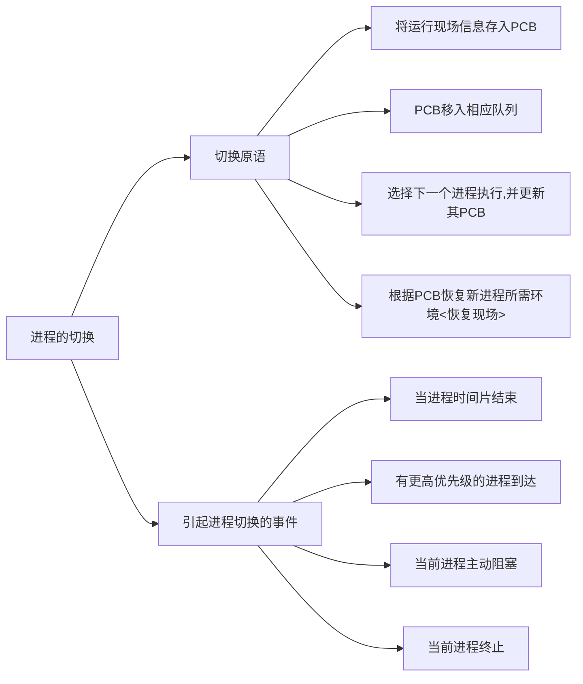
```mermaid
graph LR;
1[进程的切换]-->2[切换原语];
1-->3[引起进程切换的事件];
2-->a[将运行现场信息存入PCB]
2-->PCB移入相应队列
2-->选择下一个进程执行,并更新其PCB
2-->b[根据PCB恢复新进程所需环境<恢复现场>]
3-->当进程时间片结束
3-->有更高优先级的进程到达
3-->当前进程主动阻塞
3-->当前进程终止
```

## 进程通信

+ <font color='orange'>进程间通信</font>（Inter-Process Communication），指两个进程之间产生数据交互

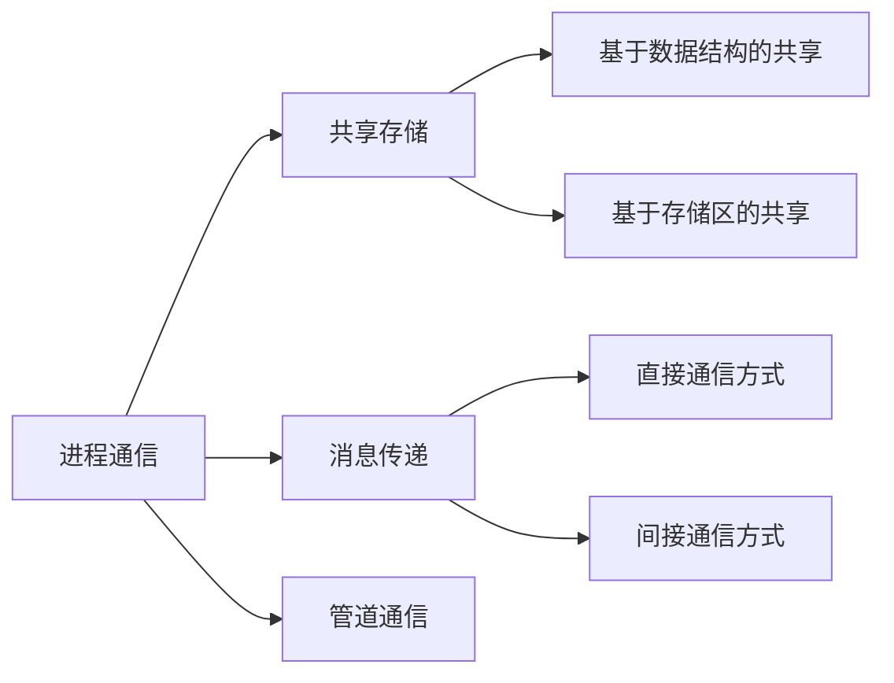
```mermaid
graph LR;
1[进程通信]-->2[共享存储]
2-->基于数据结构的共享
2-->基于存储区的共享
1-->3[消息传递]
3-->直接通信方式
3-->间接通信方式
1-->管道通信
```

### 共享存储


+ 进程之间共享存储,需要确保<font color='red'>不同进程</font>对存储空间的<font color='red'>访问(写入)</font>是<font color='red'>互斥</font>的

**基于数据结构的共享**

​	共享空间里只能使用<font color='red'>固定</font>的<font color='red'>格式(数据类型)</font>，共享速度<font color='red'>慢</font>，限制多，是一种<font color='red'>低级通信</font>方式

**基于存储区的共享**

​	操作系统在<font color='red'>内存</font>中划出一片共享存储区，数据的类型、位置都由通信进程控制，而非操作系统，共享速度<font color='red'>快</font>，是一种<font color='red'>高级通信</font>方式


### 消息传递


+ 进程间的数据交互以<font color='red'>格式化的信息</font>为单位，进程通过操作系统提供的“发送消息/接受消息”两个<font color='red'>原语</font>进行数据交换

**直接通信方式**

​	要指明<font color='red'>接受进程</font>的 <font color='red'>PID</font>

**间接通信方式**

​	通过"<font color='red'>信箱</font>"间接地通信,因此又称"信箱通信方式"


### 管道通信


+ 管道通信,本质上是一个特殊的共享文件,又名 `pipe` 文件,即在内存中开辟一个<font color='red'>大小固定</font>的<font color='red'>内存缓存区</font>,其遵循<font color='red'>先进先出</font>原则
+ 管道通信是<font color='red'>半双工通信</font>,一段时间内只能实现单向数据传输,若需要<font color='red'>双向同时通信</font>,则<font color='red'>必须设置两个管道</font>
+ **注意**: 管道并非是临时创建,管道的分配由系统实现,需要控制各个进程<font color='red'>互斥</font>的使用管道
+ 当<font color='red'>管道写满</font>时,<font color='red'>写进程</font>将<font color='red'>阻塞</font>,直到读进程把管道中的数据取走
+ 当<font color='red'>管道读空</font>时,<font color='red'>读进程</font>将<font color='red'>阻塞</font>,直到写进程向管道中写入新数据
+ 管道中的<font color='red'>数据一旦读出,就彻底消失</font>,因此,当多个进程读同一个管道时,可能引发错误.
+ ==管道允许多个进程写入,一个进程读出==

### 总结

+ 进程通信
  + 共享存储
    + 设置一个共享存储区, 进程将其映射到自己的虚拟存储地址空间
    + 进程之间要互斥的访问共享存储区(由通信双方进程自己实现, 借助系统提供的pv互斥工具)
    + ==两个方式==
      1. 基于数据结构(灵活性差)
      2. 基于存储区(灵活)
  + 消息传递
    + 传递结构化消息(包含消息头/消息体)
    + 系统提供**发送**和**接受**原语
    + ==两个方式==
      1. 直接通信: 消息放入接收进程的消息队列中
      2. 间接通信: 消息先放入中间体(内核信箱)
  + 管道通信
    + 设置特殊的管道文件作为内存缓存区
    + 一个管道只能实现半双工通信
    + 双工通信需两个管道
    + 各进程需互斥访问管道(由操作系统实现互斥)
    + ==管道写满、读空时, 将触发进程阻塞==

## 进程调度方式

+ 非剥夺调度方式

  + 只允许进程主动放弃处理机资源, 再运行过程中即便由优先级更高的任务到达, 当前进程仍然会继续占用处理机, 直至该进程主动请求进入阻塞态

    > ==特点==
    >
    > 1. 适用于早起批处理系统
    >
    > 2. 实现简单, 系统开销小, 无法及时处理紧急任务

+ 剥夺调度方式

  + 当一个进程正在处理机上运行时, 若由更紧迫的进程需要使用处理机, 则立刻暂停当前执行的进程, 将处理机分配给那个更紧迫的进程

    > ==特点==
    >
    > 1. 可以优先处理紧急任务, 也能实现各个进程按时间分片轮流执行
    > 2. 适用于分时操作系统、实时操作系统

## 调度算法评价指标

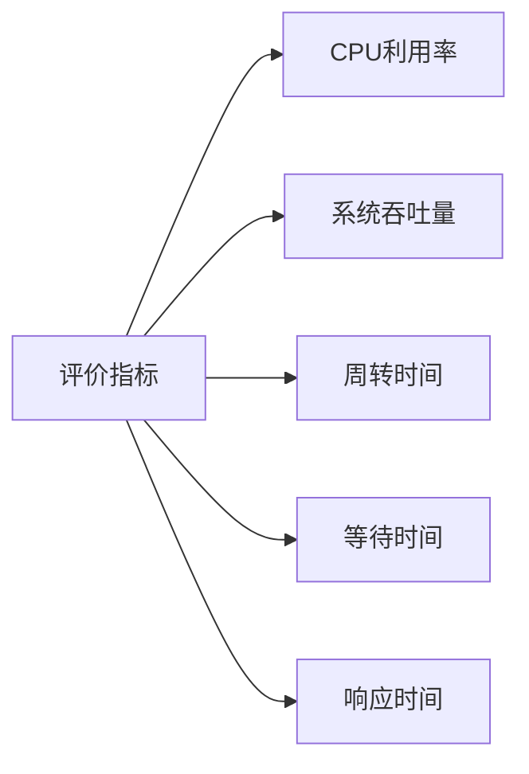
```mermaid
graph LR;
1[评价指标]-->2[CPU利用率];
1-->3[系统吞吐量];
1-->4[周转时间];
1-->5[等待时间];
1-->6[响应时间];
```

> ==注意==
>
> 等待时间对于**进程**和**作业**是不同的
>
> 1. 对于进程, 等待时间是指进程创建后等待服务的时间之和, 等待 I/O 完成的期间其实也是在被服务, 因此不计入等待时间
> 2. 对于作业, 等待时间包括建立进程后的等待时间以及作业在外存PCB队列中的等待时间


# 线程

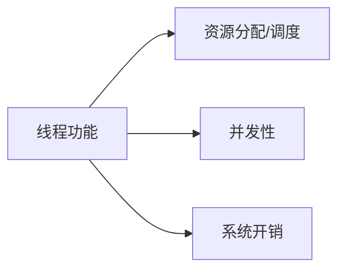
```mermaid
graph LR;
1[线程功能]-->2[资源分配/调度];
1-->3[并发性];
1-->4[系统开销];
```

## 线程的功能

+ 资源分配、调度方面

  + 传统进程机制中，进程是资源分配、调度的基本单位
  + 引入线程后，进程是资源分配的基本单位，线程是调度的基本单位

  > ==理解==
  >
  > 如今, 进程主要用于向系统请求分配系统资源的工具
  >
  > 处理机调度执行的单位变为了进程里的线程

+ 并发性方面

  + 传统进程机制中,只能进程间并发
  + 引入线程后, 各线程也能并发, 提升了并发度

+ 系统开销方面

  + 传统的进程间并发, 需要切换进程允许环境, 系统开销大
  + 线程间并发, 若是同一个进程中线程的切换, 则无需切换进程允许环境,系统开销小
  + ==引入线程后, 并发带来的系统开销减少==

## 线程的属性

+ 线程是处理机调度的单位
+ 多 CPU 计算机中, 各个线程可占用不同 CPU
+ 每个线程都有一个线程id、线程控制块（TCB）
+ 线程也有就绪、堵塞、运行三种基本状态
+ 线程几乎不拥有系统资源
+ 同一进程的不同线程之间共享进程的系统资源
+ 由于共享内存地址空间、同一进程中的线程间通信甚至无需系统介入干预
+ 同一进程中的线程切换，不会引起进程切换
+ 不同进程中的线程切换，会引起进程切换
+ 切换同进程中的线程，系统开销很小
+ 切换进程，系统开销较大

## 线程实现方式

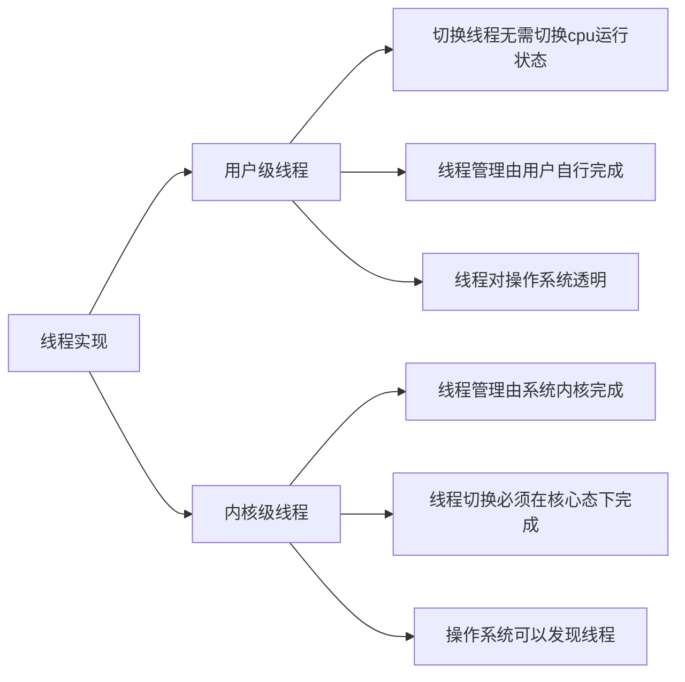
```mermaid
graph LR;
1[线程实现]-->2[用户级线程];
2-->4[切换线程无需切换cpu运行状态];
2-->5[线程管理由用户自行完成];
2-->6[线程对操作系统透明];
1-->3[内核级线程];
3-->a[线程管理由系统内核完成];
3-->b[线程切换必须在核心态下完成];
3-->c[操作系统可以发现线程];
```


+ 内核级线程
  + 优点
    + 一个线程被阻塞后, 别的线程可以继续执行, 并发能力强
    + 多个线程可以在多核处理机上`并行`执行

+ 用户级线程
  + 优点
    + 用户级线程切换在进程空间内即可完成, 无需改变cpu运行状态,开销小效率高
  + 缺点
    + 一个用户线程被阻塞后, 整个进程都会被阻塞, 并发度不高, **多个线程不能在多核处理机上并行运行**

## 多线程模型

### 一对一


+ 一对一模型
  + 一个用户级线程映射到一个内核级线程, 每个用户进程由与用户线程同数量的内核级线程
  + 优点
    + 一个线程被阻塞, 别的线程还可以继续运行, 并发能力强
    + 多线程可在多核处理机上并行运行
  + 缺点
    + 一个用户进程会占用过多内核级线程
    + 线程切换由系统完成, 用户切换线程需要改变cpu运行状态, 因此管理成本高, 效率低

### 多对一


+ 多对一模型
  + 多个用户线程映射到一个内核级线程,且默认一个进程只分配一个内核级线程
  + 优点
    + 用户级线程的切换在用户空间内完成, 无需改变cpu运行状态, 线程管理成本低, 效率高
  + 缺点
    + 一个用户线程阻塞后, 整个进程阻塞, 并发度低, 多线程不可再多核处理机上并行运行

### 多对多


+ 多对多模型
  + n 个用户线程映射到 m 个内核级线程上==($n>=m$)==, 每个用户进程对应 m 个内核级线程
  + 优点
    + 克服了多对一模型并发度不高的缺点, 又克服了一对一模型中一个用户进程占用过多内核级线程,开销太大的缺点

## 线程的组织与控制

```mermaid
graph LR;
1[TCB]-->2[线程标识符TID];
1-->3[程序计数器PC];
1-->4[其他寄存器];
1-->5[堆栈指针];
1-->6[线程运行状态: 就绪/运行/堵塞];
1-->7[优先级];
```

> 线程三种组织方式
>
> 1. 每个进程包含一张线程表
> 2. 所有进程公用一张线程表
> 3. 不同运行状态的线程使用不同的线程表


## 线程调度

+ 低级调度

  + 按照某种策略从就绪队列中选取一个进程, 将处理机分配资源给他

+ 中级调度

  + 系统内存不足时, 可将某些进程的数据调出外存, 等待内存空闲或者进程需要运行时再重新调入内存
  + 暂时调到外存等待的进程状态为==挂起状态==, 被挂起的进程 PCB 会被组织成 ==挂起队列==, 类似阻塞态,阻塞队列

+ 高级调度

  + 按一定原则从外存的作业后备队列中选取一个作业调入内存,并创建进程
  + ==每个作业的生命周期内只会被调入内存一次,调出内存一次==

  > ==理解==
  >
  > 用户同时执行多个作业任务时, 而系统资源不足时, 根据调度原则选择作业的调入执行顺序
  >
  > 调入执行创建进程PCB
  >
  > 调出执行销毁进程PCB


> ==重要概念==
>
> 临界资源: 一个时间段只允许一个进程使用的资源, 各进程需要互斥的访问临界资源
>
> 内核程序临界区: 一般是用于 某种内核数据结构, 例如就绪队列
>
> 普通程序临界区: 例如打印机, 不影响操作系统内核的管理工作, 因此内核仍可以进行调度核切换

# 调度算法

## FCFS

+ ==先来先服务(First Come First Serve)==
+ ==优点==
  + 公平, 实现简单
+ ==缺点==
  + 排在长作业(进程)后的短作业需等待很长时间, **带权周转时间很大**


## SJF

+ ==短作业优先(Shortest Job First)==

+ 追求**最少的平均等待时间**

+ 可能发生饥饿

+ ==优点==

  + "最短的"平均等待时间, 平均周转时间

  > "最短的" 不严谨, 某些情况下**最短剩余时间算法STRN(抢占式SJF, 又称SRTN)**可以得到更短的平均等待时间, 平均周转时间

+ ==缺点==

  + 不公平, 对短作业有利, 对长作业不利

### 非抢占式

 

### 抢占式


##  HRRN

+ ==高响应比优先(Highest Response Ratio Next)==
+ 特点:
  + 非抢占式
  + 每次调度选择当前响应比最高的进程执行

**响应比**: 
$$
响应比=\frac{等待时间+要求服务时间}{要求服务时间}
$$

**带权周转时间**
$$
带权周转时间=\frac{作业周转时间}{作业实际运行实际}
$$


## RR

+ ==时间片轮转调度算法==
+ 抢占式算法
+ 伴随分时操作系统的诞生而生
+ ==优点==
  + 响应快, 适用于分时操作系统
+ ==缺点==
  + 由于高频率的进程切换,因此有一定系统额外开销
  + 不区分进程优先级


> ==时间片过大==
>
> 每个进程都可以在一个时间片中执行完成, 则时间轮转算法**退化为先来先服务算法**, 增大进程响应时间
>
> ==时间片过小==
>
> **导致进程切换过于频繁**, 造成大量不必要的系统开销, 使得实际用于进程执行的时间比例减少
>
> ==一般而言,设计时间片大小应该使得切换进程的开销占比不超过 $1\%$==


## 优先级调度算法

+ 每个作业/进程都有各自的优先级
+ 调度时选择优先级最高的进程/作业
+ 抢占式 or 非抢占式
+ 可能导致饥饿
+ ==优点==
  + 可以用优先级区别紧急程度、重要程度，适用于实时操作系统
+ ==缺点==
  + 若源源不断有高优先级进程到来，可能导致饥饿

### 非抢占式


### 抢占式


> ==补充==
>
> + 就绪队列未必只有一个, 可以按照不同优先级组织, 另外,还可以将优先级更高的进程安排在更靠对头的位置
> + 根据优先级是否可以动态变化, 可将优先级分为**静态优先级**和**动态优先级**
>   + 静态优先级: 进程创建后, 优先级一直不变
>   + 动态优先级: 进程创建后, 优先级根据情况动态发生变化


## 多级反馈队列调度

+ 设置多级就绪队列，各级队列**优先级**从**高到低**，**时间片**从**小到大**
+ 新进程到达，先进入第一级队列，按 **FCFS** 原则排队等待分配时间片，若时间片结束**仍未完成**，则进程调入**下一级队列队尾**，若此时已经处于最下级队列，则重新放入最下级队列队尾
+ **抢占式算法**

+ ==只有前 $n$ 个优先级队列为空, 才会从第 $n+1$ 级队头开始分配时间片==
+ 可能导致饥饿

+ ==优点==
  + 对各类型进程相对公平(**FCFS优点**, 等待时间较少)
  + 每个新到达的进程都可以很快得到响应(**RR优点**)
  + 短进程只用较少时间就可完成(**SPF优点**, 运行时间较少)
  + 不必实现估计进程的运行时间(**避免用户伪造运行时间预期**)
  + ==动态调整各类进程的偏好程度==
    + 例如: I/O 密集型进程因 I/O 阻塞, 可以将其重新放入原队列中去, 因此 I/O 密集型进程可以长期保持较高优先级

## 多级队列调度

+ 系统按照进程类型设置多个队列
+ 队列之间可采用固定优先级, 或者按时间片划分
  + 固定优先级: 高优先级进程为空时, 低优先级才能被调度
  + 时间片划分: 多个队列按照一个比例划分一个时间片, 例如: 50%, 40%, 10%
+ ==各队列可采用不同调度策略==
  + 系统进程采用 **优先级调度**
  + 交互进程采用 **RR**
  + 批处理进程采用 **FCFS**

## 总结

> SJF: 优先考虑服务时间, 要求服务时间短的优先
>
> FCFS: 优先考虑等待时间, 要求等待时间长的优先
>
> HRRN: 综合考虑等待时间和服务时间, 对于长作业而言, 等待时间越长, 响应比越大
>
> 通常情况下: 💢
>
> + 系统进程优先级 **高于** 用户进程
> + 前台进程优先级 **高于** 后台进程
> + 操作系统更偏好 **I/O** 型进程, 也称 ==I/O 密集型进程==, 相对的有 **计算型** 进程, 也称 ==CPU 密集型进程==


 


# 进程互斥

## 基础概念

+ 对**临界资源**的互斥访问, 逻辑上可分四个部分

  + 进入区: 检查是否可以进入 **临界区**, 若可进入, 应设置正在访问临界资源的标志(**上锁**)
  + 临界区: 关于访问互斥资源的代码
  + 退出区: 负责解除正在访问临界资源的标志(**解锁**)
  + 剩余区: 其他处理

  ```c++
  do{
      entry section;  	//进入区
      critical section;	//临界区
      exit section;		//退出区
      remainder section;	//剩余区
  }
  ```

  > 临界资源的互斥访问应遵守以下原则
  >
  > 1. 空闲让进
  >    + 临界区空闲时, 可以允许一个请求进入临界区访问资源
  > 2. 忙则等待
  >    + 当已有进程进入临界区,其他试图进入临界区的进程必须等待
  > 3. 有限等地
  >    + 对请求访问的进程, 应保证能再有限时间内能够访问临界资源(保证不饥饿)
  > 4. 让权等待
  >    + 当进程不能进入临界区时, 应立即释放处理机, 防止进程忙等待

## 实现方法

### 软件

#### 单标志法

+ 两个进程在访问完临界区后, 会将使用临界区的权限交给另一进程, ==即每个进程访问临界区的权限只能来自于另一个进程==

> **存在问题(缺点)**
>
> ==违背了 "空闲让进" 原则, 如果 a 进程将权限让权给了 b, 但 b 进程又一直不访问临界区, 则 a 进程就会一直得不到访问权限, 因为访问权限只能来着与 b 进程==


#### 双标志先检查

+ 设置一个布尔值数组 $flag[]$ , 数组中各个元素用于标记各进程对于访问临界区的意愿, $1$ 表示有意愿, $0$ 表示无意愿

> **存在问题(缺点)**
>
> ==违反了 "忙则等待" 的原则==


#### 双标志后检查

+ 同双标志先检查法一样, 设置布尔值数组 $flag[]$, 不同点在于**双标志后检查**先表达意愿(上锁), 再检查是否可以访问

> **存在问题(缺点)**
>
> ==违背 "空闲让进, 有限等待" 原则==


#### Peterson 算法

> 该算法依然处理不了 **让权等待** 问题, 每个进程会一次占用处理机不断循环判断是否能够访问临界区


### 硬件


+ 利用中断, 进行开中断,关中断
  + 优点: 简单高效
  + 缺点: ==不适用多核处理机==, 不适用于用户进程, 因为 开/关 中断只能运行在内核态, 无法让用户来执行


+ TestAndSet(又称TestAndSetLock, 简称 TSL)

  + 优点: 实现简单, 硬件实现
  + 缺点: 不满足 "让权等待" 原则, 暂时无法访问临界资源的基础会一直占用 CPU, 循环执行 TSL 指令, 造成忙等

  > TSL指令将**上锁**与**检查**合并为了一个不可分割的**原子操作**, 从而避免了软件实现互斥过程中, 异步执行造成的影响


+ Swap 指令(又称 Exchange, 或 XCHG 指令)
  + 优点: 实现简单, 硬件实现
  + 缺点: 不满足 "让权等待" 原则, 暂时无法访问临界资源的基础会一直占用 CPU, 循环执行 TSL 指令, 造成忙等


# 锁


## 互斥锁

+ 互斥锁(mutex lock), 是解决临界区最简单的工具, 一个进程进入临界区时获得锁, 退出时释放锁
  + `acquire()` 获得锁
  + `release()` 释放锁

```c++
acquire(){
    while(!available){};
    available = false;
}
release(){
    available = true;
}
```

> `acquire()` 与 `release()` 必须是原子操作, 因此互斥锁通常采用硬件机制实现
>
> 忙等期间, 时间片用完了, 进程直接下处理机, 不会持续占用 cpu 资源
>
> STL, Swap, 单标志法 是自旋锁, 进程在忙等时, 不会下处理机, 而是一直占用处理机循环等待


## 信号量机制

+ **信号量**是一个变量, 表示系统中某种资源的数量
+ **原语**: `wait(S)` 与 `signal(S)`, 括号里的 `信号量S` 就是调用函数传入的参数
+ `wait()`和`signa()`常常简称为 ==P、V操作==

### 整型信号量

+ 存在 "忙等" 现象, 不满足 "让权等待" 原则

```c++
int S = 1;	//全局资源数量
void wait(int s){
    while(s <= 0);	//若资源不足, 则循环等待("忙等")
    s = s - 1;
}
void signal(int s){
    s = s + 1;		//进程结束, 释放资源
}
```


### 记录型信号量

+ 遵循了 "让权等待" 原则, 不会出现 "忙等" 现象

```c++
typedef struct{
    int value;			//资源数量
    Struct process *L; 	//阻塞挂起队列
} semaphore;
void wait (semaphore S){
    S.value --;			//资源减一
    if(S.value < 0){
        block(S.L); 	//发现当前资源不足, 主动自我阻塞
    }
}
void signal (semaphore S){
    S.value ++;			//进程结束, 释放资源
    if(S.value <= 0){
        wakeup(S.L);	//从阻塞队列中,释放队头的一个进程, 并把自己占用的资源分配给它
    }
}
```

> 信号量机制, 可以实现复杂条件下的进程同步问题
>
> ==其将拓扑图中的每条边,作为一个资源通过信号量来表示, **前驱进程**必须先释放某些资源, **后继进程**才能继续完成==


```c++
p1() {
    s1:
    v(a); // 释放a资源
    v(b); // 释放b资源
}

p2() {
    p(a); // 请求a资源
    s2;
    v(c); // 释放c资源
    v(d); // 释放d资源 
}
```


# 生产者-消费者问题


> **互斥信号量**: `mutex` 缓冲区需要互斥访问, 避免多个生产者进程写同一个地址
>
> **同步信号量**: 
>
> + `empty` 表示空闲缓冲区数量
> + `full` 表示非空缓冲区数量

```c++
producer (){
    while(1){
        P(empty);	// ①
        P(mutex);	// ②
        
        V(mutex);
        V(full);
    }
}

consumer () {
    while(1){
        P(full);	// ③
        P(mutex);	// ④
        
        V(mutex);
        V(empty);
    }
}
```

> ③ ④ 操作顺序不能改变
>
> ① ② 操作也不能改变
>
> **举例**
>
> 当缓存区满了, `producer` 执行 `P(mutex)` 后获取了临界区资源, 然后 `P(empty)` 此时缓冲区无空闲, 因此主动阻塞, 时间片结束后, `consumer` 上处理机, 执行 `P(mutex)`, 发现互斥资源无空闲, 也主动阻塞. 从此两个进程陷入死循环 "**死锁**"

# 多生产者-多消费者问题

+ 问题不同点, 在于**生产者**产生的数据并非完全一致的, 不同生产者可能产生不同类型的数据
+ **消费者**需要从缓存中读取的数据也不一定一致


> **缓冲区大小**若为 `1`, 那么有可能就无需单独设置**互斥信号量**, 就能实现互斥访问
>
> **互斥信号量**
>
> + `mutex` 互斥访问 plate (缓冲区)
>
> **同步信号量**
>
> + `apple` 盘中有多少苹果
> + `orange` 盘中有多少橘子
> + `plate` 盘中还可放多少水果
>
> ==对于同步信号量,需要关注于事件的发生先后,而不必聚焦于某些进程的先后逻辑==

```c++
dad(){
    while(true){
        // 准备苹果
        P(plate);
        P(mutex);
        // 苹果放入缓冲区
        V(mutex);
        V(plate);
    }
}
mom(){
    while(true){
        // 准备橘子
        P(plate);
        P(mutex);
        // 橘子放入缓冲区
        V(mutex);
        V(plate);
    }
}
daughter(){
    while(true){
        P(plate);
        P(mutex);
        // 从缓冲区拿走苹果
        V(mutex);
        V(plate);
        // 吃掉苹果
    }
}
son(){
    while(true){
        P(plate);
        P(mutex);
        // 从缓冲区拿走橘子
        V(mutex);
        V(plate);
        // 吃掉橘子
    }
}
```

# 吸烟者问题


 


> **互斥信号量:** 
>
> + 
>
> **同步信号量**: 
>
> + `offer1` 表示组合一
> + `offer2` 表示组合二
> + `offer3` 表示组合三
> + `finish` 表示吸烟是否完成

# 读者写者问题

+ **两类进程**
  + 读进程
  + 写进程
+ **互斥关系**
  + 写进程 - 读进程
  + 写进程 - 写进程

> **互斥信号量**
>
> + `rw` 用于实现共享文件的互斥访问
> + `mutex` 用于保证对 `count` 变量的互斥访问
>+ `w` 用于实现**写进程优先**
> 
>**同步信号量**
> 
> + `count` 用于记录当前有多少个进程在访问文件

```c++
writer() {
    while(1){
        P(w);
        P(rw);
        // 写文件
        V(rw);
        V(w);
    }
}
reader() {
    while(1){
        P(w);
        P(mutex);
        if(count==0)
            P(rw);
        count++;
        V(mutex);
        V(w);
        // 读文件
        P(mutex);
        count--;
        if(!count)
            V(rw);
        V(mutex);
    }
}
```

# 哲学家问题


